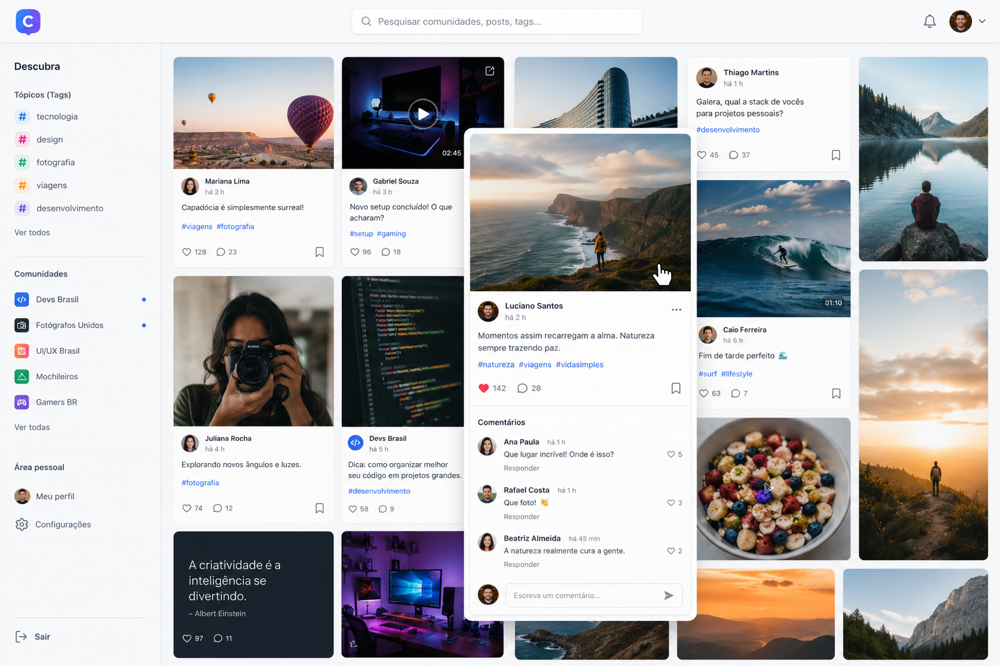
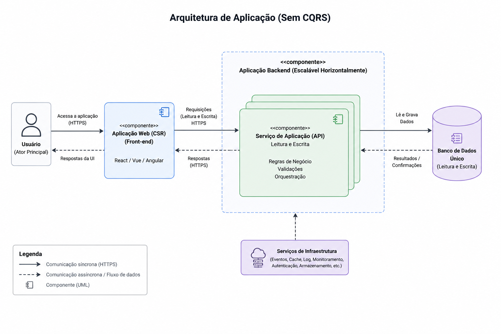
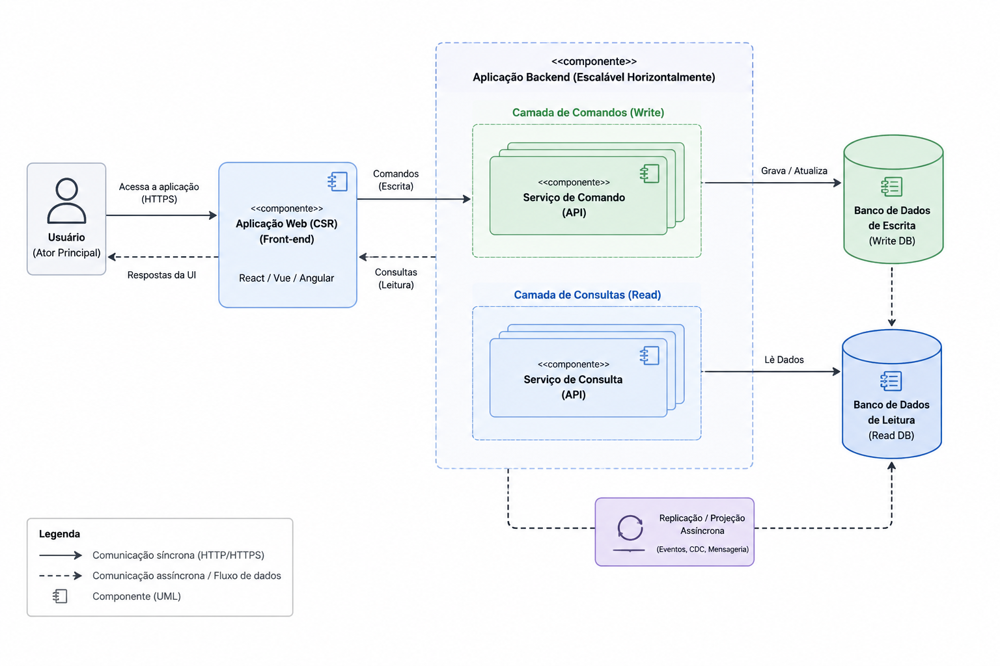

# Guia de Apresentação — Computação Aplicada em Arquitetura de Software

## Objetivo da apresentação
Esta apresentação deve falar sobre Arquitetura de Software e o padrão CQRS. A apresentação deve mostrar o valor dessa arquitetura, quais problemas ela resolve e quais os trade-offs que precisamos nos preocupar ao adota-la em nossos sistemas.
O tema será apresentado de maneira narrativa, como um conto, pois dessa forma, a audiência (alunos de mestrado em computação aplicada) se colocarão na pele do desenvolvedor que está atuando na engenharia de software em como a aplicação será planejada e evoluída. Apesar desse tipo de abordagem, a apresentação deverá contar com conceitos acadêmicos e pontos de destaque nos slides que trazem o contexto lúdico para o contexto ciêntífico e prático (casos reais de mercado/empresas).
A apresentação irá contar a história de George, um desenvolvedor que constrói um MVP rápido com IA (utilizando Vibe Coding), publica o produto, ganha tração e, em seguida, enfrenta problemas de escala, concorrência e latência. A narrativa mostra como a arquitetura monolítica clássica pode ser suficiente no começo, mas se tornar um gargalo à medida que o sistema cresce.
As áreas de estudo que serão apresentadas por trás do estudo de caso, são: CQRS, Event Sourcing e o contexto teórico por trás de cada uma das decisões arquiteturais. Será incluído também, cenários de colapso reais que aconteceram na indústria com grandes empresas e causaram perdas financeiras devido à problemas arquiteturais de software.

---

## Roteiro completo da apresentação

### Slide 1 — Abertura
**Título:** Computação Aplicada em Arquitetura de Software  
**Subtítulo:** Sincronização de dados desnormalizados em sistemas distribuídos orientado a eventos e de alta concorrência

**Contexto para a fala:**
- Apresentar o tema central do seminário.
- Criar um "gancho" de apresentação para capturar a atenção ao tema e controlar a espectativa da audiência.
- Explicar que a discussão gira em torno de como sistemas modernos lidam com leitura, escrita, concorrência e escalabilidade.

**Público-alvo:** alunos de pós graduação - Mestrado Profissional em Computação. Público mesclado entre recém formados e profissionais com ampla experiência no mercado de trabalho.

---

### Slide 2 — Conheçam o George
**Tema:** Estudo de caso simulado

**Narrativa:**
George é um desenvolvedor que usa inteligência artificial todos os dias para ser mais produtivo. Em um fim de semana, ele decide transformar uma ideia ambiciosa em realidade: criar uma rede social centrada em comunidades de nicho, pensada para atrair um público jovem à um conceito que perdurou as redes sociais nos anos 2000.

**Mensagem principal:**
- O objetivo de George é lançar rápido e validar o produto com usuários reais antes de investir em infraestrutura complexa.
- Esse comportamento é típico de startups e MVPs.
- Comportamento incentivado e ampliado pelo Vibe Coding.

**Frase de apoio:**
“Com vibe coding, devo montar ainda neste fim de semana uma versão testável para alguns usuários e validar minha ideia.”

**Visual sugerido:**
- Imagem do MVP funcional construído em fim de semana.
- Mostrar a interface como prova de que o produto saiu do papel rapidamente.

**Interface do MVP:**
Utilizar como base a imagem em `assets/Sistema vibe coded do George.png`

---

### Slide 3 — A jornada com Vibe Coding
**Tema:** Da ideia ao produto em escala

**Sequência de progressão:**
1. Fim de semana — O MVP
   - George desenvolve a aplicação com IA generativa.
   - Frontend em React, backend em Node.js e PostgreSQL.
   - O sistema funciona localmente sem grandes problemas.

2. Segunda-feira — Publicação
   - O deploy é feito em um servidor cloud compartilhado.
   - George distribui o link para amigos, grupos de tecnologia e comunidades de desenvolvedores.

3. Duas semanas — Primeiros 100 usuários
   - A comunidade surge organicamente.
   - O engajamento é alto.
   - O feedback é majoritariamente positivo.

4. Primeiro mês — Tração orgânica
   - O boca a boca supera qualquer estratégia de marketing.
   - O tráfego cresce 500% em relação ao lançamento.
   - O produto atinge o product-market fit.

5. Três meses — 10.000 usuários ativos
   - O sucesso é real, mas começam os sinais de instabilidade.
   - George recebe notificações de erro de madrugada.

**Ponto central:**
A escalada do sucesso expõe a fragilidade da arquitetura inicial.

**Dicas para o slide:**
Apresentar cada _bullet point_ progressivamente (a cada clique) para que os ouvintes acompanhem a ideia.

---

### Slide 4 — Feedback dos usuários
**Tema:** O sucesso e os primeiros sinais de problema

**Feedback positivo (mês 1):**
- “Que app incrível! As comunidades de nicho foram uma sacada genial.”
- “Acredita que até minha avó está usando? Ela ama a comunidade de jardinagem!”
- “Mostrei pros colegas de trabalho. Já é o app mais usado do meu time.”

**Reclamações (mês 3):**
- “Tentei adicionar um comentário e ele simplesmente sumiu.”
- “Não consigo editar meus posts — o botão trava por vários segundos.”
- “O feed demora uma eternidade pra carregar. Já pensei em desinstalar.”

**Mensagem:**
O crescimento trouxe visibilidade, mas também expôs limitações técnicas que precisam ser corrigidas.

---

### Slide 5 — Momento de reflexão
**Tema:** Como vocês construiriam essa arquitetura?

**Pausa para discussão:**
Antes de revelar a escolha de George, o apresentador deve fazer os participantes refletirem sobre:
- Quais tecnologias seriam escolhidas para um MVP rápido?
- Quais padrões de banco de dados seriam mais adequados?
- Como equilibrar velocidade de lançamento com robustez futura?

**Observação importante:**
Software não nasce robusto e isso é aceitável. A engenharia de software precisa projetar para o cenário atual e evoluir conforme o sistema cresce. Um MVP superengenheirado pode comprometer a validação do produto.

**Revelação:**
A arquitetura escolhida por George inicialmente é uma arquitetura monolítica clássica.

**Componentes da arquitetura:**
- Frontend: React (CSR) consumindo APIs REST
- Backend: Node.js com camadas Controller → Service → Repository
- Banco: PostgreSQL normalizado, com transações ACID

**Dicas para o slide:**
Os questionamentos devem ser o foco na parte da interação, devem aparecer dinâmicamente e chamar a atenção num primeiro momento.
Ao avançar para a "revelação" da arquitetura, o foco deve ser a arquitetura, sendo construída aos poucos em tela para os alunos irem acompanhando.
Exemplo: visão inicial de componentes (usuário, Frontend, Backend), começam a aparecer os componentes internos do backend (serviços, banco de dados, e integrações).

---

### Slide 6 — Impacto no mercado
**Tema:** Quando falhas técnicas viram prejuízo financeiro

**Contexto:**
O problema de George não é exclusivo de startups ou desenvolvedores individuais. Grandes empresas sofreram impactos financeiros por falhas de escala, configuração e disponibilidade.

**Casos citados:**
- Amazon — Prime Day 2018
  - A Amazon não alocou servidores suficientes para o pico de tráfego e precisou acionar uma página simplificada de contingência.
  - Serviços dependentes do sistema interno Sable foram afetados, incluindo Prime, autenticação e reprodução de vídeo.
  - Perda direta não divulgada: a CNBC reportou impacto geral mínimo nas vendas, enquanto a Atlassian usa a Amazon como exemplo ilustrativo de negócio em que downtime pode custar cerca de US$ 13,22 milhões por hora.
  - Fontes: https://www.cnbc.com/2018/07/19/amazon-internal-documents-what-caused-prime-day-crash-company-scramble.html; https://www.atlassian.com/incident-management/kpis/cost-of-downtime

- Facebook — Março de 2019
  - Queda global afetou Facebook, Instagram e WhatsApp por cerca de 14 horas.
  - A causa declarada foi uma mudança de configuração de servidor que disparou falhas em cascata.
  - Estimativa externa de receita publicitária perdida: US$ 90 milhões.
  - Fontes: https://www.cnbc.com/2019/03/13/facebook-suffers-outage-related-to-core-whatsapp-and-instagram.html; https://www.atlassian.com/incident-management/kpis/cost-of-downtime

- Custo médio do setor
  - Gartner estimou custo médio de US$ 5.600 por minuto de indisponibilidade em 2014.
  - Estudos citados pela Atlassian variam de US$ 2.300 a US$ 9.000 por minuto, dependendo do porte e setor; para empresas médias e grandes, a referência operacional usada é próxima de US$ 9.000 por minuto.
  - Fonte: https://www.atlassian.com/incident-management/kpis/cost-of-downtime

**Mensagem:**
Falhas de arquitetura, capacidade ou operação não são apenas problemas técnicos; podem se tornar problemas financeiros e de reputação.

**Dicas para o slide:**
Foco em um case por vez para discussão do apresentador. Problema e números em destaque.

---

### Slide 7 — Sessão de debug
**Tema:** Investigando a causa-raiz do gargalo

**Passo 1 — Monitoramento de CPU**
- Comando: `top -p $(pgrep postgres)`
- Resultado: PostgreSQL CPU em 98,7% e I/O Wait em 64%
- Conclusão: o banco está operando no limite, com muita espera por disco.

**Passo 2 — Consultas bloqueadas por locks**
- Comando: `SELECT count(*) FROM pg_stat_activity WHERE wait_event_type = 'Lock';`
- Resultado: 342 conexões aguardando liberação de locks
- Conclusão: escritas e leituras estão competindo por recursos e travando uma à outra.

**Passo 3 — Proporção leitura vs escrita**
- Leitura: 89% das queries
- Escrita: 11% das queries
- Conclusão: operações com perfis muito distintos disputam o mesmo recurso físico.

**Diagnóstico final:**
O backend foi escalado horizontalmente, mas o banco de dados permaneceu como ponto único de gargalo. O problema não está na aplicação em si, mas na arquitetura.

**Dicas para o slide:**
Apresentar progressivamente, dando a impressão de que todos em sala estão procurando o problema junto ao George.
Adicionar animações para deixar mais "empolgante".

---

### Slide 8 — O padrão CQRS
**Tema:** Command Query Responsibility Segregation

**Definição:**
CQRS separa as responsabilidades de escrita (Commands) e leitura (Queries). A separação pode ficar em objetos, modelos, serviços ou bancos distintos, mas isso é uma decisão arquitetural, não uma exigência do padrão.

**Command Side (escrita):**
- Focado em integridade transacional
- Valida regras de negócio
- Mantém o modelo de estado consistente, frequentemente com transações ACID

**Query Side (leitura):**
- Focado em velocidade
- Pode consultar projeções desnormalizadas, caches e índices otimizados
- Simplifica consultas e formatos de leitura

**Linha do tempo do padrão:**
- 1988 — Bertrand Meyer publica *Object-Oriented Software Construction*, obra à qual Fowler atribui a cunhagem de CQS: comandos alteram estado; consultas retornam dados sem efeitos colaterais observáveis ([Open Library](https://openlibrary.org/books/OL2033837M/Object-oriented_software_construction), [Fowler, 2005](https://martinfowler.com/bliki/CommandQuerySeparation.html))
- 2009 — Udi Dahan publica [*Clarified CQRS*](https://udidahan.com/2009/12/09/clarified-cqrs/), separando CQRS de Event Sourcing e destacando colaboração, staleness e captura de intenção
- 2010 — Greg Young publica [*CQRS, Task Based UIs, Event Sourcing agh!*](https://web.archive.org/web/20101223100708/http://codebetter.com/gregyoung/2010/02/16/cqrs-task-based-uis-event-sourcing-agh/), definindo CQRS como separação entre objetos/responsabilidades de comando e consulta
- 2011 — Martin Fowler publica [*CQRS*](https://martinfowler.com/bliki/CQRS.html), descrevendo o uso de modelos diferentes para atualização e leitura e alertando para a complexidade adicional

**Mensagem:**
Mostrar o que o CQRS resolve e quais os trade-offs disso.

---

### Slide 9 — Redesenho arquitetural com CQRS
**Tema:** O sistema do George com CQRS

**Resultado esperado:**
Com a separação entre escrita e leitura, a latência do feed cai de 1.200 ms para menos de 50 ms e os bloqueios desaparecem.

**Trade-offs do CQRS:**
- Necessidade de sincronização entre os bancos de escrita e leitura
- Dados duplicados e desnormalizados no lado da leitura
- Complexidade operacional maior
- Mudança de consistência forte para consistência eventual

**Mensagem:**
CQRS resolve a contenção, mas impõe uma nova camada de complexidade e um novo modelo de consistência.

**Dicas para o slide:**
Utilizar a arquitetura de monolito como base e evoluir para CQRS dentro do slide.
Exemplo: animar a divisão do banco de dados, adicionar as estratégias de atualização de dados, apontar os trade-offs

---

### Slide 10 — Teorema CAP e consistência eventual
**Tema:** Fundamentos teóricos

**Teorema CAP:**
Em caso de partição de rede, um sistema distribuído não consegue garantir simultaneamente consistência forte (visão única/linearizável) e disponibilidade para todas as requisições.

**Interpretação para o CQRS:**
- CQRS, por si só, não define uma escolha no CAP; ele separa modelos de escrita e leitura.
- Se o read model é atualizado de forma assíncrona/distribuída, a arquitetura pode privilegiar leituras disponíveis com dados temporariamente defasados.
- O lado de escrita ainda pode usar transações ACID; a consistência eventual aparece na propagação para leitura.

**ACID vs BASE:**
- ACID: Atomicidade, Consistência, Isolamento e Durabilidade; típico de transações no modelo de escrita.
- BASE: Basically Available, Soft State, Eventual Consistency; típico de sistemas que aceitam convergência posterior para ganhar disponibilidade/escala.

**Analogia cotidiana:**
Em muitos feeds sociais, uma publicação pode levar alguns instantes para aparecer para todos os seguidores. O feed converge com o tempo. Isso é consistência eventual e costuma ser aceitável para interações humanas.

**Fontes/Referências:**
- Brewer (2012), "CAP Twelve Years Later": CAP trata de escolhas durante partições, não de uma regra simples "2 de 3". https://doi.org/10.1109/MC.2012.37
- Gilbert & Lynch (2002), prova formal da conjectura CAP. https://doi.org/10.1145/564585.564601
- Vogels (2009), "Eventually Consistent": consistência eventual como convergência quando não há novas atualizações. https://doi.org/10.1145/1435417.1435432
- Haerder & Reuter (1983), fundamentos de transações ACID. https://doi.org/10.1145/289.291
- Pritchett (2008), "BASE: An Acid Alternative". https://doi.org/10.1145/1394127.1394128

---

### Slide 11 — Event Sourcing
**Tema:** Padrão complementar

**Definição:**
Event Sourcing persiste cada alteração de estado como um evento em sequência. O estado atual deixa de ser a fonte primária e pode ser reconstruído pela reprodução do log de eventos.

**Vantagens:**
- Auditoria completa
- Replay e reconstrução de estado
- Projeções de leitura derivadas dos eventos

**Histórico:**
- 2005 — Martin Fowler publica Event Sourcing como padrão: mudanças de estado armazenadas como sequência de eventos.
- 2010 — Greg Young publica CQRS Documents; em 2011, Fowler registra CQRS como descrito por Young e observa que ele combina bem com Event Sourcing.
- 2011 — Kreps et al. apresentam Kafka como sistema distribuído para processamento de logs; útil para streams/projeções, mas não é sinônimo de Event Store.

**Fluxo do modelo:**
Command → Event Store → Projeção de leitura

**Relação com CQRS e Kafka:**
CQRS separa escrita e leitura; Event Sourcing pode ser o modelo de persistência da escrita, enquanto projeções alimentam as leituras. Kafka/logs entram como infraestrutura de distribuição e processamento de eventos, não como requisito do padrão.

**Exemplo de eventos:**
- UsuarioCriado
- ComunidadeCriada
- MembroAderido
- PostPublicado

**Dicas para o slide:**
Apresentar conceitualmente o Event Sourcing e exemplificar com os eventos de forma "animada".

**Fontes/Referências:**
- Martin Fowler — Event Sourcing: https://martinfowler.com/eaaDev/EventSourcing.html
- Greg Young — CQRS Documents: https://cqrs.files.wordpress.com/2010/11/cqrs_documents.pdf
- Martin Fowler — CQRS: https://martinfowler.com/bliki/CQRS.html
- Jay Kreps et al. — Kafka: a Distributed Messaging System for Log Processing: https://www.microsoft.com/en-us/research/wp-content/uploads/2017/09/Kafka.pdf
- Martin Kleppmann — Turning the database inside-out: https://www.confluent.io/blog/turning-the-database-inside-out-with-apache-samza/

---

### Slide 12 — Casos reais relacionados
**Tema:** Princípios relacionados a CQRS em sistemas de larga escala

**Amazon — Dynamo**
- Problema: serviços centrais da Amazon precisavam continuar lendo e escrevendo mesmo com falhas de nós, rede ou datacenter.
- Solução: armazenamento chave-valor altamente disponível, com replicação, versionamento, quorum configurável e consistência eventual. Não é descrito como CQRS; é um caso de princípios relacionados a disponibilidade e consistência eventual.

**Netflix — migração para cloud e microserviços**
- Problema: arquitetura de datacenter/monólito dificultava escalar e operar globalmente o streaming.
- Solução: migração para AWS, decomposição em centenas de microserviços, NoSQL e modelo de dados desnormalizado. A fonte não chama isso de CQRS; é um exemplo de padrões compatíveis, como dados distribuídos, desnormalização e modelos otimizados para leitura.

**Uber — Schemaless + MySQL**
- Problema: o datastore de viagens em PostgreSQL não escalaria com o crescimento, e a Uber precisava de disponibilidade de escrita, índices secundários e notificações para dependências downstream.
- Solução: Schemaless, um datastore próprio sobre MySQL particionado, com células append-only, buffered writes, triggers, índices secundários eventualmente consistentes e dados desnormalizados para consultas rápidas. Não é descrito como CQRS, mas usa princípios relacionados a logs, projeções/índices e processamento assíncrono.

**Mensagem:**
Esses casos não provam adoção formal de CQRS; mostram que separação de responsabilidades, consistência eventual, logs, caches, índices/projeções e modelos de leitura otimizados aparecem em sistemas reais de larga escala.

**Fontes/Referências:**
- Amazon — DeCandia et al., "Dynamo: Amazon's Highly Available Key-value Store": https://www.allthingsdistributed.com/2007/10/amazons_dynamo.html
- Netflix — Completing the Netflix Cloud Migration: https://about.netflix.com/en/news/completing-the-netflix-cloud-migration
- Uber — Designing Schemaless, Uber Engineering's Scalable Datastore Using MySQL: https://www.uber.com/en-BR/blog/schemaless-part-one-mysql-datastore/
- Uber — The Architecture of Schemaless, Uber Engineering's Trip Datastore Using MySQL: https://www.uber.com/en-BR/blog/schemaless-part-two-architecture/

---

### Slide 13 — Referências e encerramento
**Tema:** Bibliografia e fechamento

**Referências principais:**
- Meyer, Bertrand — Object-Oriented Software Construction
- Gilbert & Lynch — Brewer’s Conjecture and the Feasibility of Consistent, Available, Partition-Tolerant Web Services
- Brewer — CAP Twelve Years Later
- Vogels — Eventually Consistent
- Haerder & Reuter — Principles of Transaction-Oriented Database Recovery
- Pritchett — BASE: An Acid Alternative
- Fowler — Event Sourcing
- DeCandia et al. — Dynamo: Amazon’s Highly Available Key-value Store
- Udi Dahan — Clarified CQRS
- Greg Young — CQRS Documents
- Martin Fowler — CQRS
- Kreps et al. — Kafka: A Distributed Messaging System for Log Processing
- Kleppmann — Designing Data-Intensive Applications
- Netflix — Completing the Netflix Cloud Migration
- Uber Engineering — Schemaless datastore using MySQL
- CNBC/Atlassian — Casos e estimativas de impacto financeiro por indisponibilidade

**Encerramento:**
A apresentação conclui que a separação entre leitura e escrita, combinada com Event Sourcing, pode ser um caminho viável para superar limitações físicas de concorrência em sistemas distribuídos modernos.

**Dicas para o slide:**
Apresentar as referências junto a uma "recapitulação" do assunto.

---

## Tom de apresentação recomendado
- Use uma linguagem técnica, mas acessível.
- Faça a narrativa parecer um caso real de crescimento de produto.
- Destaque que o problema central não é apenas performance, mas arquitetura.
- Mostre que o CQRS é uma resposta inteligente para sistemas com alta leitura e escrita concorrente.

## Dica de apresentação
Ao falar, apresente a história em camadas:
1. MVP simples e rápido
2. Crescimento e sucesso inicial
3. Falhas arquiteturais sob carga
4. Reestruturação com CQRS e Event Sourcing
5. Aprendizado de engenharia e escala
